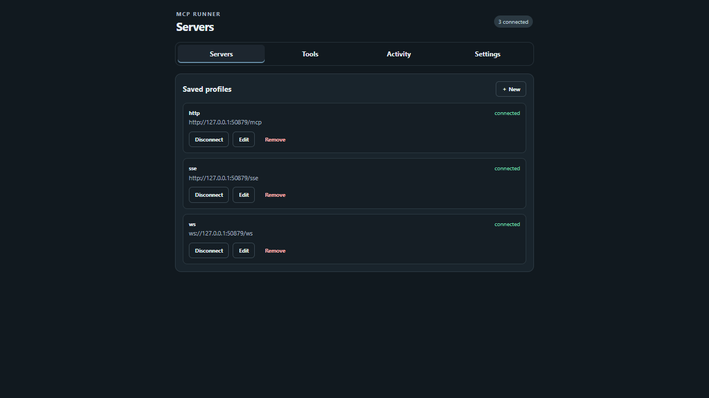
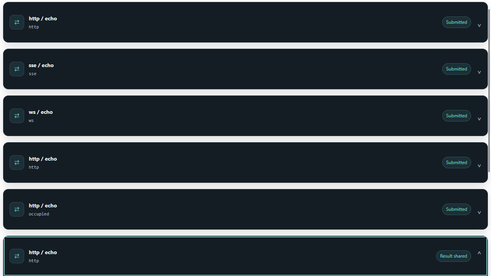

# MCP Runner

Connect MCP servers to your browser sidebar and use their tools in supported AI chats.

> Built for [gredit-mcp](https://github.com/Lebenoa/gredit-mcp), but can be used with any other MCP server.

> **Warning:** MCP Runner executes tools on servers you connect, and it runs tool calls that an AI model decides to emit. A misconfigured, compromised, or malicious server — or a model influenced by prompt injection — can cause destructive actions or expose sensitive data. Tool classifications and approvals are your judgment calls, not verified safety. Review tools before trusting them, prefer Auto-safe or Ask over the permissive presets, read every approval and disclosure prompt, and only connect servers you trust. You are responsible for the servers you connect and the actions you approve.




## Features

- Connect servers over Streamable HTTP, legacy HTTP/SSE, or WebSocket.
- Run tools from the sidebar or supported AI conversations.
- Choose between reviewed execution, per-call approval, server permissions, and automatic approval.
- Inspect requests and responses in expandable cards with structured JSON and copy controls.
- Return multiple tool results together in one chat message.
- Reconnect previously connected servers when the extension starts.

## Supported sites

| Site | Capability |
| --- | --- |
| [DeepSeek](https://chat.deepseek.com) | Automatic tool execution in new conversations |

The sidebar itself works independently of any site, and servers can be hosted anywhere reachable by the browser. Support for additional chat providers is planned.

## Installation

Download a prebuilt extension zip from the [Releases](https://github.com/Lebenoa/mcp-runner/releases) page — `mcp-runner-chrome-*.zip` for Chromium browsers, `mcp-runner-firefox-*.zip` for Firefox — unzip it, and load the unpacked folder per the table below.

To build from source instead, install [Deno](https://deno.com/) 2.9 or later. Run these commands from the project directory:

```sh
deno install
```

```sh
deno task build
```

| Browser | Load the extension |
| --- | --- |
| Chrome, Edge, Helium | Open Extensions, enable **Developer mode**, choose **Load unpacked**, and select `.output/chrome-mv3` |
| Firefox | Open `about:debugging` → **This Firefox** → **Load Temporary Add-on**, and select `.output/firefox-mv2/manifest.json` |

Click the extension toolbar button to open the sidebar. Firefox's temporary installation must be loaded again after a browser restart.

## Usage

The sidebar groups controls by task: **Servers** manages connections and profiles; **Tools** reviews and runs tools; **Activity** holds approvals, server questions, and results; **Settings** controls permissions, chat access, and prompt instructions. Activity shows a badge when approvals are waiting. Switching tabs keeps profile drafts and tool arguments. Use Left/Right arrows or Home/End to navigate focused tabs.

### Connect a server

1. Start your MCP server separately.
2. In **Servers**, select **New** and enter a unique profile name, server URL, and transport.
3. Select **Save profile**, then **Connect**.
4. Choose **Allow** when the browser requests access to the server.

Use the endpoint provided by your server: HTTP/SSE URLs start with `http://` or `https://`; WebSocket URLs start with `ws://` or `wss://`. WebSocket servers must support the `mcp` subprotocol.

Open **Tools**, expand a discovered tool, enter its JSON arguments, and select **Run tool**. Open **Activity** to handle pending approvals and inspect results.

Streamable HTTP session expiry (HTTP 404) triggers one replacement session and tool rediscovery, then rechecks execution permissions before retrying the rejected call once. Concurrent expired calls share recovery. Changed tool definitions invalidate saved classifications; approval may be required again. Other transport failures are reported without automatic retry because execution may already have occurred. Failed replacement or repeated expiry clears the tool list and reports an error instead of advertising a connected session.

An MCP request timeout (`-32001`) restores the session and rediscovers tools for subsequent commands, but **does not replay the timed-out command**: its execution outcome is unknown. The original command remains failed in Activity. If restoration fails, the error includes both failures. A timeout alone does not establish session expiry or identify whether the server or browser transport stopped responding.

For tools advertising a `timeout_ms` input property, a positive safe-integer argument extends the client deadline to at least that duration plus 10 seconds for delivery (minimum 60 seconds). For example, `timeout_ms: 300000` allows 310 seconds for the MCP response instead of the SDK's default 60 seconds. Other tools retain the default deadline; the server still enforces its own execution timeout.

Streamable HTTP SSE responses treat both JSON-RPC results and errors as terminal. Completed error streams are not resumed, avoiding unnecessary GET streams after failed batches. Interrupted streams without a terminal response still support resumption. The SDK 1.29.0 transport is vendored in `src/vendor/streamableHttp.js` with this narrow correction; its upstream license is preserved alongside it.

**Disconnect** attempts HTTP session termination and always closes the local client, even if termination fails. Servers that do not support DELETE (405), or have already removed the session (404), do not prevent disconnect. Disconnect during recovery prevents the replacement from becoming connected. Browser/offscreen eviction can still abandon a server session without sending DELETE.

### Use tools in an AI chat

1. Connect the servers you want to use.
2. In **Settings**, enable site access for the supported chat integration, approve the browser permission, and reload the chat page.
3. Start a **new conversation** and send your request normally.

MCP Runner prepends tool instructions and the connected tools' descriptions and input schemas to your first message. Your request remains beneath those instructions. Existing conversations and later messages are not modified. **System prompt** lets you preview, copy, and edit the instructions: saved custom instructions replace the defaults in new conversations, while the tool list beneath them is always regenerated from connected servers. This text is user-message context, not a privileged system message.



Expand a card to inspect **Request**, **Response**, or **Raw JSON**. When approval is needed, use the card's **Approve** button or the sidebar. Multiple calls in one assistant response return together after every call finishes or fails. If your composer contains a draft, results wait instead of replacing it.

### Query or change server connections

The model can emit this block to list all saved servers, their connection status, errors, and available tool names:

````text
```mcp-status
{"id":"status-1"}
```
````

To connect or disconnect a saved profile, add `action` and its exact name. Replace `SERVER_NAME` below with your saved profile name:

````text
```mcp-status
{"id":"connect-1","action":"connect","server":"SERVER_NAME"}
```

```mcp-status
{"id":"disconnect-1","action":"disconnect","server":"SERVER_NAME"}
```
````

Connection changes return an updated status listing. Connect needs browser permission already granted through the sidebar. Wait for its result before issuing dependent tool calls. Each request needs a unique ID within the conversation.

## Configuration

### Permission mode

Choose the permission mode in **Settings**.

| Mode | What happens |
| --- | --- |
| **Auto-safe** — default | Automatically runs tools you reviewed as read-only and not consequential. Other calls ask for approval. Unreviewed or sensitive results ask before being shared. |
| **Ask** | Asks before each tool call. Unreviewed or sensitive results also ask before being shared. |
| **Server Perms** | Runs every tool exposed by the server and shares results without extension approval. Server elicitation still asks you. |
| **YOLO** | Same access as Server Perms, plus automatic acceptance of form elicitation when supplied fixed/default values satisfy the requested schema. |

**Server Perms and YOLO can perform destructive actions and share private data without another execution or disclosure prompt.** Neither mode unlocks tools disabled by the server.

Auto-safe relies on your classifications, not an inspection of the tool's implementation. Server safety hints do not automatically grant trust. Changed tool definitions require a new review.

Elicitation is a server request for confirmation or information. For a recognized gredit workspace-change confirmation, the exact canonical path is shown with **Approve / Deny**; YOLO approves it automatically. Missing required information and URL-based consent still need interaction in every mode.

### Saved profiles

Disconnect a profile before selecting **Edit**. Change its name, URL, or transport, then save; **Cancel** leaves it unchanged. Changing the endpoint or transport clears its tool reviews.

Successfully connected profiles reconnect at startup. Explicitly disconnecting or editing one disables automatic reconnection until you connect again. Offline servers show an error; select **Connect** to retry after starting them. Profiles saved before this feature need one successful connection to enable it.

If a live connection drops unexpectedly — for example the server restarts — the host tears down the dead session and retries the connection every 5 seconds until the server answers. Disconnecting explicitly stops the retries.

## Development

The project uses TypeScript and WXT with Deno tooling. Start development with:

```sh
deno task dev
```

Install the test browser, build, and run tests:

```sh
deno run -A npm:playwright install chromium
deno task build
deno task test
```

Browser tests use local MCP fixtures and intercepted chat pages, not a live AI account. Fresh Chromium test profiles need two native **Allow** clicks: for the local fixture server and the chat site. Unanswered dialogs cause timeouts.

On Windows with PowerShell and Helium installed, use `deno task test:helium`. To select another Chromium executable, replace `BROWSER_PATH` with its full path:

```powershell
pwsh -NoProfile -File scripts/test-helium.ps1 -BrowserPath "BROWSER_PATH"
```

## Limitations and troubleshooting

- **No tools appear:** start the server, check the endpoint and transport, and grant browser access. Stdio and credential/OAuth configuration are not supported.
- **Existing chat does not know the tools:** copy **System prompt** into that chat or start a new conversation.
- **A batch is waiting:** check pending approvals and elicitation, then clear or send your composer draft.
- **Workspace approval timed out:** retry with a new call ID. In non-YOLO modes, approve the server's canonical path before the timeout.
- **After an extension update:** reload the extension and chat tab to load the new content script.
- **Chat integration stops working:** page markup changes can require an adapter update. Only the currently implemented chat adapter supports automatic tool execution; support for additional providers is planned.
- **Firefox distribution:** builds are available for temporary loading; store publication is not configured. Browser UI verification has been exercised in Chromium/Helium, not Firefox.

## License

[MIT](LICENSE). The vendored SDK transport in `src/vendor/` carries its own upstream MIT license, preserved alongside the code.

## Acknowledgments

- Built for [gredit-mcp](https://github.com/Lebenoa/gredit-mcp); works with any MCP server over Streamable HTTP, SSE, or WebSocket.
- `src/vendor/streamableHttp.js` adapts the Streamable HTTP transport from the [MCP TypeScript SDK](https://github.com/modelcontextprotocol/typescript-sdk) 1.29.0 (MIT); its upstream license is preserved alongside it.
